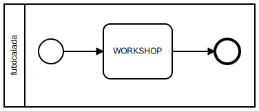

# Automacao e Simulacao de Processos de Negocio
- **LOCAL** IC UFMT
- **PUBLICO** Administracao Estatistica Programacao

# Horarios
- 8-10 [Introducao e teoria](./01/README.md)
- 10-12 [Processo de refeicao no RU](./02/README.md)
- 14-16 [Media e dispersao](./03/README.md)
- 16-18 [Simulacao e convergencia](./04/README.md)

# Objetivo

- Apresentar processos de negocio e ferramentas de modelagem
- Executar o processo num motor de simulacao
- Interagir com o processo virtualizado de forma manual e por meio de API
- Integrar o processo com demais servicos e simular variacoes
